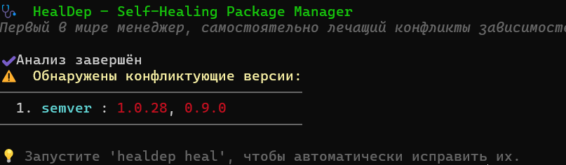
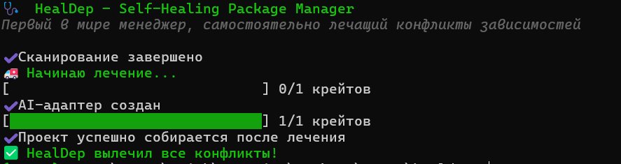
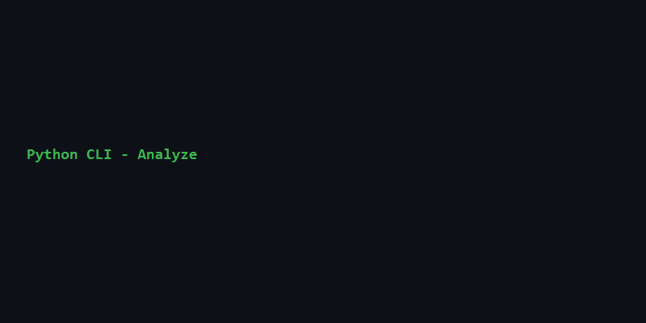
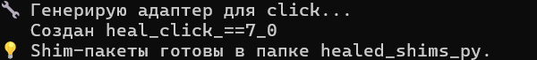
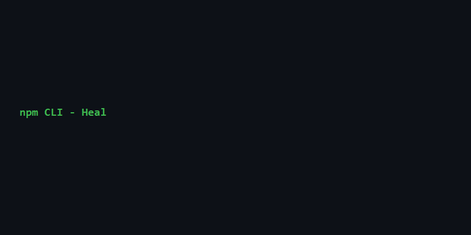

# рџ©є HealDep – Self-Healing Package Manager

Первый в мире пакетный менеджер, автоматически разрешающий конфликты зависимостей
с помощью синтеза кода (AI‑генерация адаптеров).

## Возможности
- Анализ графа зависимостей (любой Cargo‑проект)
- Обнаружение несовместимых версий (diamond dependency problem)
- Автоматическая генерация прослойки‑адаптера
- Модификация Cargo.toml «на лету»
- Проверка сборки в песочнице

## Быстрый старт
```bash
git clone git@github.com:your/healdep.git
cd healdep
cargo build --release
./target/release/healdep analyze ./examples/demo_app/Cargo.toml
./target/release/healdep heal ./examples/demo_app/Cargo.toml

## 🖼️ Скриншоты

### Rust CLI
| Анализ | Лечение | AI‑лечение |
|--------|---------|------------|
|  |  |  |

### Python CLI
| Анализ | Лечение |
|--------|---------|
|  |  |

### npm CLI
| Анализ | Лечение |
|--------|---------|
|  |  |

### Веб‑дашборд
| Главная с историей | Анализ конфликта |
|--------------------|------------------|
|  |  |

### Docker
| Запуск в контейнере | Дашборд через Docker |
|---------------------|----------------------|
|  |  |

### VS Code расширение
| Команда в палитре |
|-------------------|
|  |
